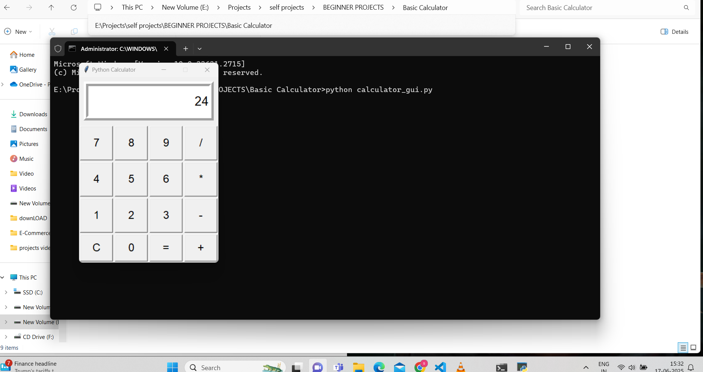

#  Basic Calculator – Python Project

This is a beginner-friendly calculator project implemented in Python.  
It includes:

-  A Command-Line Calculator
-  A GUI Calculator using Tkinter
-  Unit Tests using Python’s `unittest` module

---

##  Project Directory

Basic Calculator/
├── .gitignore
├── calculator.py # CLI calculator logic
├── calculator_gui.py # GUI calculator using Tkinter
├── test_calculator.py # Unit tests for calculator functions
├── README.md # Project overview
├── calculator_gui.png # Screenshot of the GUI
├── test_output.png # Screenshot of test results
├── vscode_terminal_calculator.png # Screenshot of CLI calculator
└── pycache/ # Python cache (can be ignored)

 1. Command-Line/VSCode_Terminal Calculator

Run It

```bash
python calculator.py
Features
Loops until you choose to quit
Handles addition, subtraction, multiplication, division
Catches divide-by-zero and invalid input

For Unit Tests
python test_calculator.py
 Tests Covered
All operations (+, -, *, /)
Edge cases like divide-by-zero

GUI Calculator (Tkinter)
GUI Features
Button-based calculator UI
Real-time evaluation of expressions
Error handling for invalid inputs

Screenshot




 Author
Swapnil Kumar Srivastava
 GitHub: @Swapniliacsd23

 License
This project is licensed under the MIT License.
You are free to use, modify, and distribute it.

 Future Improvements (Optional Ideas)
Add scientific functions (sin, cos, log, etc.)

Show calculation history

Create .exe using pyinstaller

Add dark/light themes to GUI


